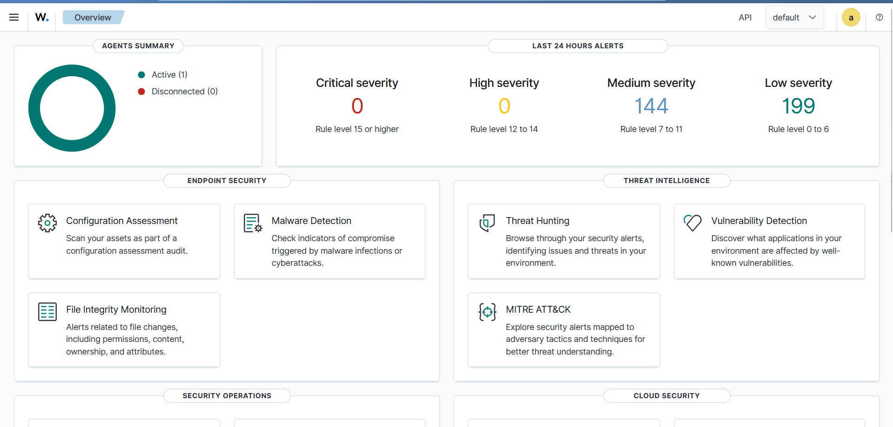
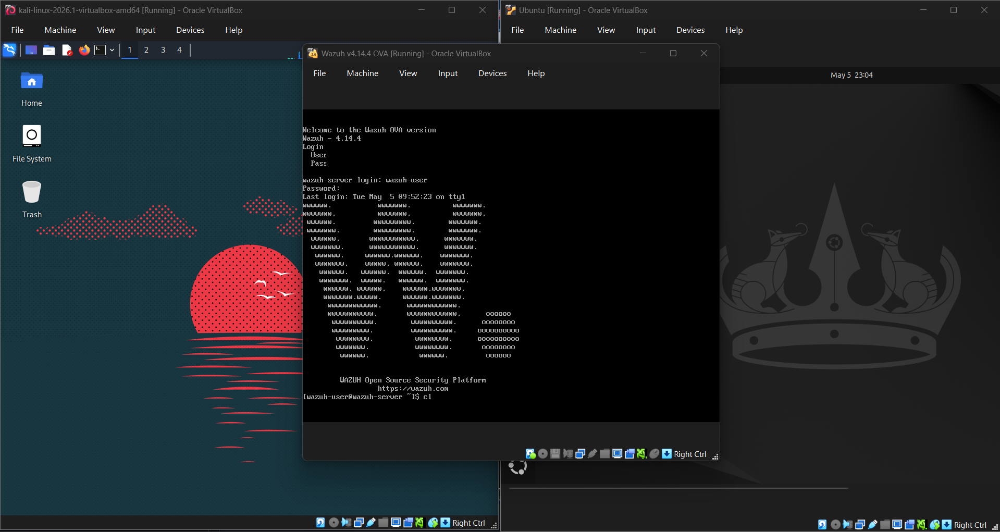
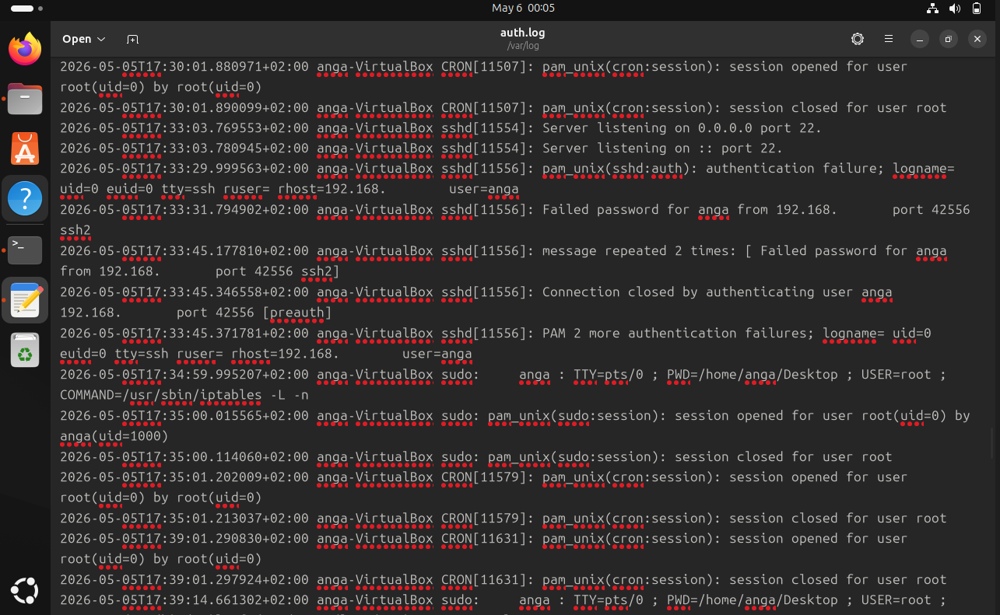
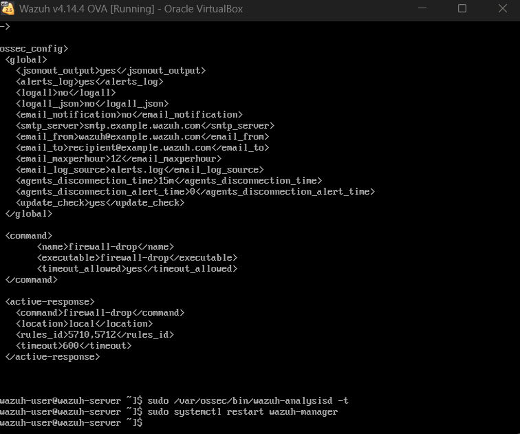
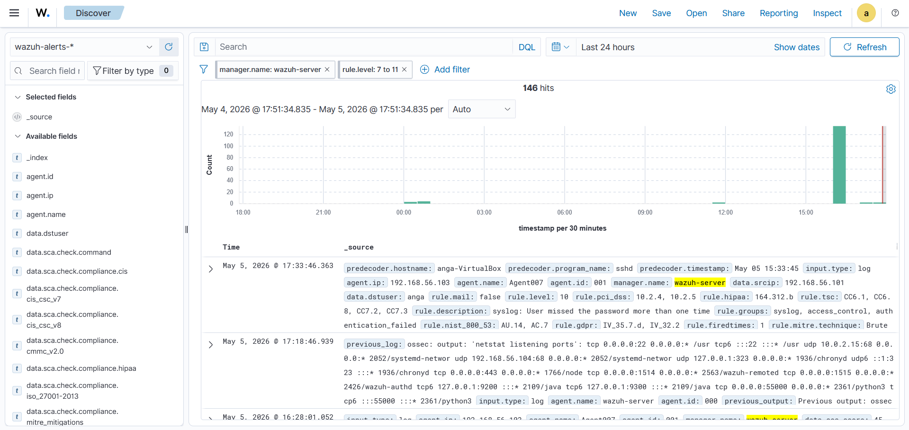
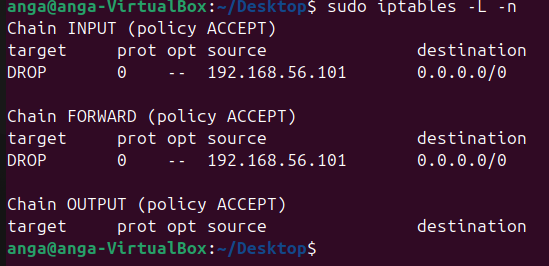
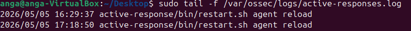

# Wazuh Active Defense SIEM System
**Automated Threat Detection and Incident Response using Wazuh and iptables**

---

## About the Project

A home lab project that combines **Wazuh SIEM/XDR** with `iptables` to build an active defense system. The system monitors SSH brute-force activity and automatically blocks the attacking IP, enabling a transition from passive detection to real-time response.



---

## Core Components

| Component | Role |
|---|---|
| **Wazuh Manager** | Collects logs, evaluates detection rules, and triggers active responses. |
| **Victim VM** | Runs the Wazuh Agent and monitors authentication logs. |
| **Kali Linux VM** | Used to simulate SSH brute-force attacks for testing. |
| **iptables** | Blocks malicious IP addresses at the host firewall level. |

---

## Network Setup

Three virtual machines running on a host-only network to simulate a real attack scenario in an isolated environment.



---

## Configuration and Implementation

### 1. Log Monitoring

The Wazuh Agent monitors the authentication log on the victim machine:

```
/var/log/auth.log
```

SSH failures are picked up in real time. Once enough failures occur within a short window, the detection rules trigger.



### 2. Active Response Setup

Configured `ossec.conf` on the Wazuh Manager with two blocks: one to define the command, one to define when it fires.

**Command:**

```xml
<command>
  <name>firewall-drop</name>
  <executable>firewall-drop</executable>
  <timeout_allowed>yes</timeout_allowed>
</command>
```

**Trigger:**

```xml
<active-response>
  <command>firewall-drop</command>
  <location>local</location>
  <rules_id>5710,5711,5712,5716</rules_id>
  <timeout>600</timeout>
</active-response>
```

The rule IDs correspond to SSH authentication failures in Wazuh's built-in ruleset. The `timeout` of `600` seconds keeps the block in place for **10 minutes** before it lifts automatically.



### 3. Attack Simulation

Used a simple loop from the Kali machine to generate repeated SSH failures and trigger the detection rules:

```bash
# Brute-force simulation
for i in {1..10}; do ssh ghost@192.168.56.103; done
```

---

## Results

### Detection

The Wazuh Manager flagged the repeated login failures and generated alerts against the relevant rule IDs.



### Automated Block

Wazuh signalled the Agent to add a `DROP` rule in `iptables` for the attacking IP. Verified with:

```bash
sudo iptables -L -n
```



### Audit Trail

The `active-responses.log` file recorded a timestamped entry of when the block was applied and what triggered it.



---

## Key Learnings

| Area | What Was Demonstrated |
|---|---|
| **XDR/SIEM Operations** | Configured and managed Wazuh from scratch, including agent deployment and rule tuning. |
| **Network Defense** | Chained SIEM detections directly into host firewall enforcement using `iptables`. |
| **Incident Response** | Automated the containment phase, reducing response time significantly. |
| **Threat Simulation** | Used Kali Linux to simulate SSH brute-force attacks in a controlled environment. |
| **Troubleshooting** | Resolved XML syntax errors and rule ID mismatches during setup. |

---

## Skills Applied

- Wazuh SIEM/XDR configuration
- SSH brute-force detection
- Linux log monitoring (`auth.log`)
- Active response automation
- `iptables` firewall rules
- Host-only VM networking
- SOC workflow implementation
- Incident detection and containment
- Security testing using Kali Linux

---

## How to Replicate

1. Set up Wazuh Manager on a Linux VM.
2. Install the Wazuh Agent on a second Linux VM (victim machine).
3. Connect a Kali Linux VM on the same host-only network.
4. Apply the `ossec.conf` configuration shown above.
5. Run the brute-force simulation and observe the alerts and firewall response.
